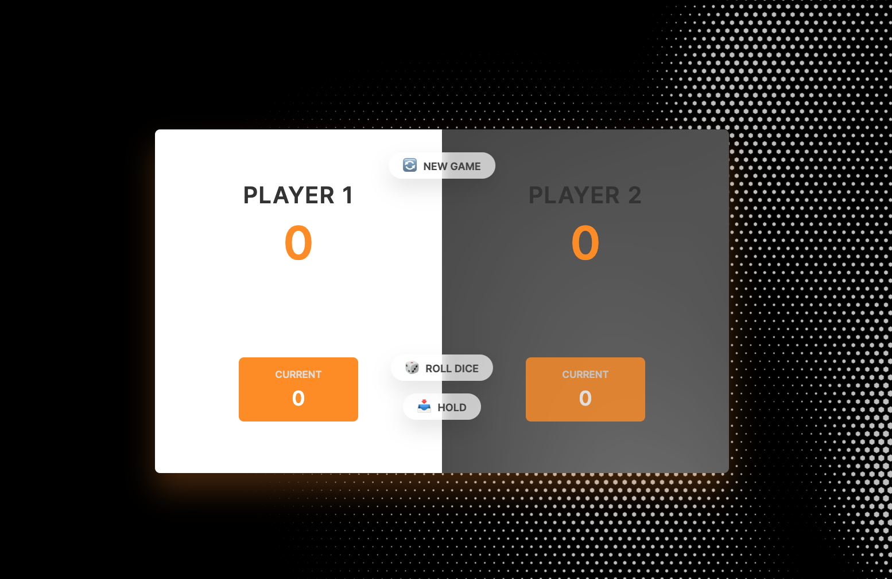

# Dice game

don't play with yourself, play with a friend

# Access

Assuming you're running @ethersphere/bee on local

| reach |                                                                  |
| ----- | ---------------------------------------------------------------- |
| true  | bzz://dice-on-swarm.eth                                          |
| hash  | 21ba5f8887999aa18c0c09b9a0ce136d2590b0627d2ac0fab437d93af65b0d33 |
| easy  | https://api.gateway.ethswarm.org/bzz/dice-on-swarm.eth/          |

---

## Recommended tool if you work with this repo

```bash
ext install ritwickdey.liveserver
```

## Usage

Click ont the roll button for a lucky shot, hold your score to store your current points. Generally intuitive.

## Looks



[def]: https://gateway.ethswarm.org/
